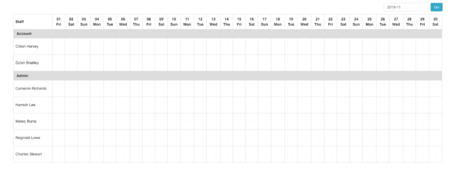

# PHP Roaster Sheet

A script to generate a dynamic roaster sheet that looks like below. 

## Features

- The script accepts the calendar year and month as parameters to generate the respective roaster
- Each of the staff members belongs to a department
- Data are stored in PHP arrays. You can easily replace those arrays with a relational data source such as MySQL

## License

[MIT](./LICENSE)

## Author

[Amila Kalansooriya](https://www.linkedin.com/in/amilakalansooriya/)